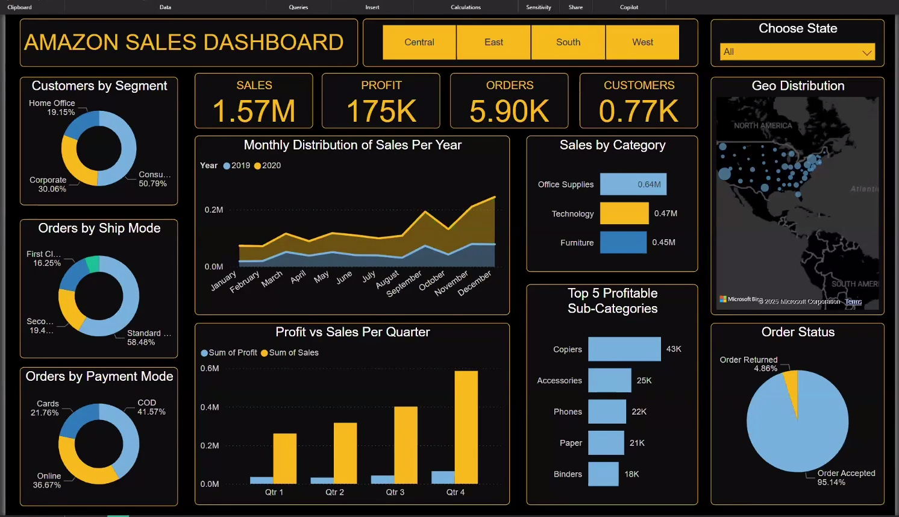
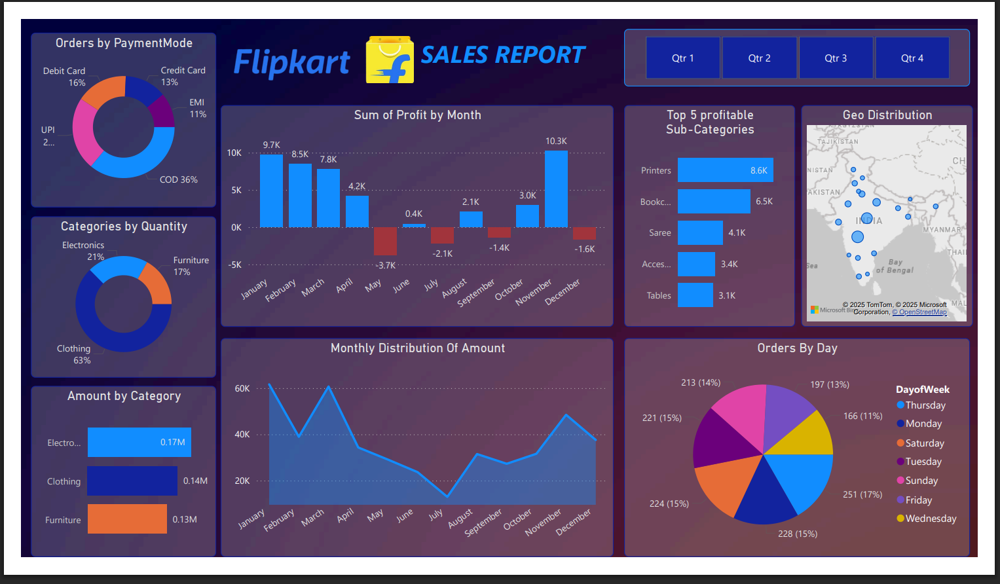

# Power BI Dashboards – Amazon & Flipkart Sales Reports

This repository contains interactive Power BI dashboards built on Amazon and Flipkart sales data.  
It includes the **Power BI report files (.pbix)**, **dataset files (.csv, .xlsx)**, and **dashboard screenshots** for quick preview.

---

## 📊 Dashboards

### 1. Amazon Sales Dashboard
- **File:** `Aamzon Sales report.pbix`
- **Dataset:** `Amazon Store Sales Data.xlsx`
- **Key Insights:**
  - Total Sales: **1.57M**
  - Profit: **175K**
  - Orders: **5.9K**
  - Customers: **0.77K**
  - Breakdown by customer segment, ship mode, and payment mode
  - Profit vs Sales per quarter
  - Geo distribution of sales
  - Top 5 profitable sub-categories

**Preview:**  

---

### 2. Flipkart Sales Dashboard
- **File:** `Flipkart_sales_report.pbix`
- **Datasets:** `Orders_Flipkart.csv`, `Details.csv`
- **Key Insights:**
  - Profit trends by month (profit/loss overview)
  - Orders breakdown by payment mode
  - Category-level analysis (Clothing, Electronics, Furniture)
  - Geo distribution of sales in India
  - Top 5 profitable sub-categories
  - Orders by day of week

**Preview:**  

---

## 🚀 How to Use
1. Clone this repository or download specific files.  
2. Open the `.pbix` files using **Power BI Desktop**.  
3. Connect with the provided datasets (if required) to refresh data.  
4. Explore the dashboards interactively.  

---

## 📌 Notes
- Dashboards are based on sample datasets (not real company data).  
- Screenshots are provided for quick preview without Power BI Desktop.  
- You can extend these dashboards by adding new KPIs, slicers, and advanced visualizations.  

---

👨‍💻 **Author:** Avinash Gupta  
🔗 [GitHub Profile](https://github.com/Avinashgupta94)
